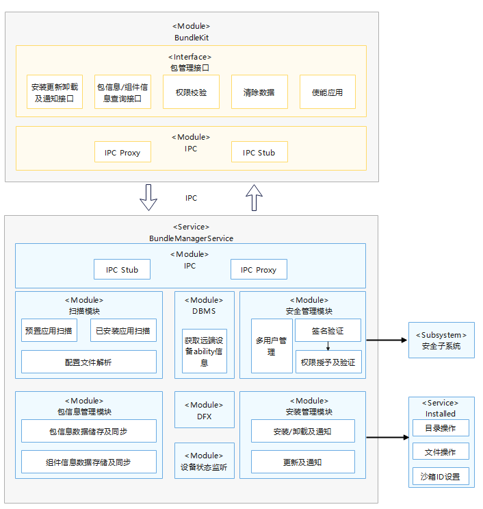

# **包管理子系统**

## 简介

包管理子系统负责应用安装包的管理，提供安装包的信息查询、安装、更新、卸载和包信息存储等能力。具体功能如下：

包管理子系统架构如下图所示：




## 部件内子模块职责

| 子模块名称       | 职责                                                         |
| ---------------- | ------------------------------------------------------------ |
| 包管理接口模块   | 1.对外提供的安装更新卸载及通知接口；<br>2.对外提供的包/组件信息/权限信息查询接口；<br>3.对外提供的应用权限查询接口；<br>4.对外提供的清除数据的接口； |
| 扫描模块         | 1.预置应用的扫描；<br>2.已安装三方应用的扫描；<br>3.包配置文件的解析； |
| 安全管理模块     | 1.安装过程中的签名校验；<br>2.安装过程中应用所申请权限的授予；<br>3.应用运行中权限的校验； |
| 安装管理模块     | 1.安装、更新、卸载逻辑处理及结果通知；                       |
| 包信息管理模块   | 1.包信息、组件信息的存储及同步；                             |
| 设备状态监听模块 | 1.监听设备的上下线；                                         |
| Installd模块     | 特权进程：<br>1）用于创建、删除等目录操作；<br>2）用于创建、删除等文件操作；<br>3）用于设备目录的沙箱uid/gid等操作 |
| DFX              | 1.包管理维测工具                                               |


## 目录

```
foundation/bundlemanager/bundle_framework
├── common
│   └── log							   # 日志组件目录
├── interfaces
│   ├── inner_api                      # 内部接口存放目录
│   └── kits                           # 应用接口
│       ├── js                         # JS接口
│       └── native                     # C/C++接口  
├── services                           # 包管理服务框架代码
└── test						       # 测试目录
```

## 相关仓

[包管理子系统](https://gitee.com/openharmony/docs/blob/master/zh-cn/readme/%E5%8C%85%E7%AE%A1%E7%90%86%E5%AD%90%E7%B3%BB%E7%BB%9F.md)

[bundlemanager_bundle_framework](https://gitee.com/openharmony/bundlemanager_bundle_framework)

[bundlemanager_bundle_tool](https://gitee.com/openharmony/bundlemanager_bundle_tool)

[bundlemanager_distributed_bundle_framework](https://gitee.com/openharmony/bundlemanager_distributed_bundle_framework)

[developtools_packing_tool](https://gitee.com/openharmony/developtools_packing_tool)
